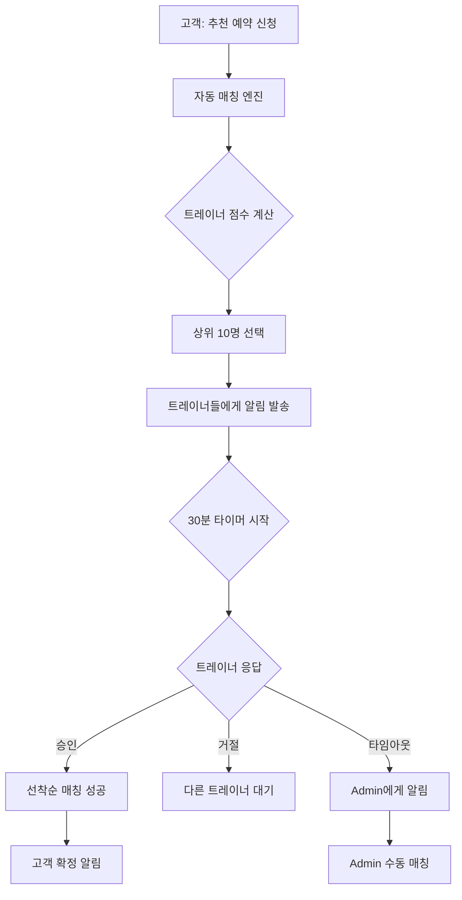

# 🤖 자동 매칭 시스템 (Auto-Matching System)

**작성일**: 2025-10-10
**버전**: 1.0.0
**상태**: 구현 완료 ✅

---

## 📋 목차

1. [개요](#개요)
2. [시스템 아키텍처](#시스템-아키텍처)
3. [데이터베이스 스키마](#데이터베이스-스키마)
4. [핵심 플로우](#핵심-플로우)
5. [구현 파일](#구현-파일)
6. [환경 설정](#환경-설정)
7. [모니터링](#모니터링)

---

## 개요

### 문제점 (As-Is)
```
고객 추천 예약 신청
    ↓
Admin이 수동으로 트레이너 매칭
    ↓
트레이너 승인 대기
    ↓
승인 시 예약 확정
```

**문제:**
- ❌ Admin이 일일이 매칭 (병목)
- ❌ 트레이너들 기회 불균등
- ❌ 매칭 시간 지연

### 해결책 (To-Be)
```
고객 추천 예약 신청
    ↓
적합한 트레이너들에게 자동 알림 (병렬)
    ↓
선착순 승인 → 자동 매칭
    ↓
30분 타임아웃 → Admin에게 알림
```

**장점:**
- ✅ Admin 개입 최소화
- ✅ 빠른 매칭 (선착순)
- ✅ 공평한 기회
- ✅ Admin은 예외 처리에만 집중

---

## 시스템 아키텍처

### 주요 컴포넌트



### 매칭 알고리즘 점수 시스템

| 기준 | 배점 | 설명 |
|------|------|------|
| 서비스 타입 | 30점 | 방문/센터 일치 |
| 전문분야 | 20점/개 | 고객 요청 전문분야 매칭 |
| 서비스 지역 | 25점 | 방문 서비스 지역 일치 |
| 경력 | 최대 10점 | 경력 1년당 2점 |
| 자격증 | 3점/개 | 보유 자격증 수 |
| 가격 | 최대 15점 | 예산 범위 내 저렴할수록 |
| 부하 분산 | 최대 20점 | 현재 예약 적을수록 |

**총점: 최대 약 150점**

---

## 데이터베이스 스키마

### Migration: `20251010140000_auto_matching_system.sql`

```sql
-- bookings 테이블 필드 추가
ALTER TABLE bookings
ADD COLUMN IF NOT EXISTS pending_trainer_ids UUID[],        -- 알림 보낸 트레이너 목록
ADD COLUMN IF NOT EXISTS notified_at TIMESTAMPTZ,           -- 알림 발송 시각
ADD COLUMN IF NOT EXISTS auto_match_deadline TIMESTAMPTZ,   -- 30분 마감 시간
ADD COLUMN IF NOT EXISTS fallback_to_admin BOOLEAN DEFAULT false,
ADD COLUMN IF NOT EXISTS admin_notified_at TIMESTAMPTZ;     -- Admin 알림 시각

-- 트레이너 응답 로그 테이블
CREATE TABLE IF NOT EXISTS trainer_match_responses (
  id UUID PRIMARY KEY DEFAULT uuid_generate_v4(),
  booking_id UUID REFERENCES bookings(id) ON DELETE CASCADE,
  trainer_id UUID REFERENCES trainers(id) ON DELETE CASCADE,
  response_type TEXT NOT NULL CHECK (response_type IN (
    'notified',   -- 알림 발송됨
    'viewed',     -- 트레이너가 확인함
    'accepted',   -- 승인 (선착순 성공)
    'declined',   -- 거절
    'too_late'    -- 늦게 승인 시도 (이미 매칭됨)
  )),
  decline_reason TEXT,
  decline_note TEXT,
  response_at TIMESTAMPTZ DEFAULT NOW(),
  created_at TIMESTAMPTZ DEFAULT NOW()
);
```

### RLS 정책
- ⚠️ **Admin**: 모든 응답 로그 조회 가능
- ⚠️ **트레이너**: 자신의 응답만 조회 가능
- ⚠️ **시스템**: 응답 로그 삽입 가능

---

## 핵심 플로우

### 1️⃣ 추천 예약 생성 & 자동 알림

**파일**: `app/(public)/booking/recommended/actions.ts`

```typescript
// 예약 생성 후 자동 매칭 시작
const autoMatchResult = await notifySuitableTrainers(booking.id)
```

**자동 매칭 엔진**: `lib/auto-matching.ts`

```typescript
export async function notifySuitableTrainers(bookingId: string) {
  // 1. 예약 정보 가져오기
  // 2. 활성화된 모든 트레이너 가져오기
  // 3. 매칭 점수 계산 및 정렬
  // 4. 상위 10명 선택
  // 5. pending_trainer_ids 업데이트
  // 6. 30분 마감시간 설정 (auto_match_deadline)
  // 7. 모든 선택된 트레이너에게 알림 발송
  // 8. 응답 로그 기록 (notified)
}
```

### 2️⃣ 선착순 승인 (Optimistic Lock)

**파일**: `app/(dashboard)/trainer/bookings/requests/[id]/actions.ts`

```typescript
export async function acceptBookingRequest(bookingId: string) {
  // Optimistic Lock - 동시성 제어
  const { data: updatedBooking } = await supabase
    .from('bookings')
    .update({
      trainer_id: trainer.id,
      matching_status: 'approved',
      status: 'confirmed'
    })
    .eq('id', bookingId)
    .eq('matching_status', 'pending')  // ⚠️ pending인 경우에만
    .is('trainer_id', null)            // ⚠️ trainer_id가 NULL인 경우에만
    .select()
    .single()

  if (!updatedBooking) {
    // 이미 다른 트레이너가 선점함
    return { error: '이미 다른 트레이너가 먼저 수락했습니다.' }
  }

  // 성공: 고객에게 확정 알림
}
```

**핵심 원리:**
- `eq('matching_status', 'pending')` + `is('trainer_id', null)` 조건
- 첫 번째 트레이너만 업데이트 성공
- 나머지 트레이너는 `updatedBooking = null` 받음

### 3️⃣ 30분 타임아웃 체크 (Cron Job)

**파일**: `app/api/cron/check-auto-match-timeout/route.ts`

**실행 주기**: 매 5분 (`*/5 * * * *`)

```typescript
export async function GET(request: NextRequest) {
  // 1. Authorization 헤더로 CRON_SECRET 검증
  // 2. 타임아웃된 예약 찾기
  //    - matching_status = 'pending'
  //    - trainer_id IS NULL
  //    - auto_match_deadline < NOW()
  //    - fallback_to_admin = false
  // 3. fallback_to_admin = true로 설정
  // 4. Admin들에게 알림 발송
}
```

**Vercel Cron 설정**: `vercel.json`

```json
{
  "crons": [
    {
      "path": "/api/cron/check-auto-match-timeout",
      "schedule": "*/5 * * * *"
    }
  ]
}
```

### 4️⃣ Admin 모니터링 대시보드

**파일**: `app/(dashboard)/admin/bookings/auto-matching/page.tsx`

**기능:**
- 📊 **통계 카드**: 24시간 총 요청, 자동 매칭 성공, Admin 개입 필요, 성공률
- ⏰ **진행 중**: 현재 자동 매칭 대기 중인 예약 (남은 시간 표시)
- 🚨 **타임아웃**: 30분 경과해서 수동 매칭 필요한 예약
- ✅ **최근 성공**: 최근 24시간 내 자동 매칭 성공한 예약

**Admin 액션:**
- 수동 매칭하기
- 예약 취소

---

## 구현 파일

### 핵심 로직
| 파일 | 역할 |
|------|------|
| `lib/matching-algorithm.ts` | 트레이너 점수 계산 알고리즘 |
| `lib/auto-matching.ts` | 자동 알림 발송 엔진 |
| `lib/notifications.ts` | 알림 템플릿 (3개 추가) |

### Actions (Server)
| 파일 | 역할 |
|------|------|
| `app/(public)/booking/recommended/actions.ts` | 추천 예약 생성 → 자동 매칭 시작 |
| `app/(dashboard)/trainer/bookings/requests/[id]/actions.ts` | 선착순 승인/거절 |
| `app/(dashboard)/admin/bookings/auto-matching/actions.ts` | Admin 재매칭/취소 |
| `app/api/cron/check-auto-match-timeout/route.ts` | Cron Job |

### UI Components
| 파일 | 역할 |
|------|------|
| `app/(dashboard)/admin/bookings/auto-matching/page.tsx` | Admin 모니터링 대시보드 |
| `app/(dashboard)/admin/bookings/auto-matching/actions-ui.tsx` | 클라이언트 컴포넌트 (취소 버튼) |

### Database
| 파일 | 역할 |
|------|------|
| `supabase/migrations/20251010140000_auto_matching_system.sql` | DB 스키마 변경 |

---

## 환경 설정

### 필수 환경 변수

```env
# .env.local

# Supabase (기존)
NEXT_PUBLIC_SUPABASE_URL=https://your-project.supabase.co
NEXT_PUBLIC_SUPABASE_ANON_KEY=your_anon_key
SUPABASE_SERVICE_ROLE_KEY=your_service_role_key

# Vercel Cron Secret (새로 추가)
CRON_SECRET=your_random_secret_string_here
```

### Cron Secret 생성 방법

```bash
# 터미널에서 실행
node -e "console.log(require('crypto').randomBytes(32).toString('hex'))"

# 출력 예시
# 5f9e8d7c6b5a4f3e2d1c0b9a8f7e6d5c4b3a2f1e0d9c8b7a6f5e4d3c2b1a0f9e
```

### Vercel 배포 시 설정

1. **Vercel Dashboard** → Project → Settings → Environment Variables
2. `CRON_SECRET` 추가 (Production, Preview, Development 모두)
3. 배포 완료 후 Cron Job 자동 활성화

---

## 모니터링

### 알림 타입

```typescript
export type NotificationType =
  | 'booking_request'        // 🆕 트레이너에게: 새 예약 요청 (선착순)
  | 'booking_request_closed' // 🆕 트레이너에게: 다른 트레이너가 수락함
  | 'auto_match_timeout'     // 🆕 Admin에게: 30분 타임아웃
  | 'booking_confirmed'      // 고객에게: 예약 확정
  | ...
```

### 로그 확인

```typescript
// trainer_match_responses 테이블
{
  booking_id: "예약 ID",
  trainer_id: "트레이너 ID",
  response_type: "notified | viewed | accepted | declined | too_late",
  response_at: "응답 시각"
}
```

### 성공률 계산

```typescript
const totalRequests = stats?.length || 0
const autoMatchedCount = stats?.filter(s => s.matching_status === 'approved').length || 0
const successRate = totalRequests > 0
  ? Math.round((autoMatchedCount / totalRequests) * 100)
  : 0
```

---

## 트러블슈팅

### 1. Cron Job이 실행되지 않음

**확인사항:**
- ✅ `vercel.json`에 cron 설정 있는가?
- ✅ Vercel에 배포했는가? (로컬에서는 작동 안함)
- ✅ `CRON_SECRET` 환경 변수 설정했는가?

**해결:**
```bash
# Vercel Dashboard에서 로그 확인
# Settings → Functions → Cron Jobs
```

### 2. 선착순 매칭이 중복됨

**원인:** Optimistic Lock 실패

**확인:**
```sql
-- 중복 매칭 확인
SELECT booking_id, COUNT(*)
FROM trainer_match_responses
WHERE response_type = 'accepted'
GROUP BY booking_id
HAVING COUNT(*) > 1;
```

**해결:** `eq('matching_status', 'pending')` + `is('trainer_id', null)` 조건 확인

### 3. 알림이 발송되지 않음

**확인사항:**
- ✅ `pending_trainer_ids` 배열에 트레이너 ID가 있는가?
- ✅ `SUPABASE_SERVICE_ROLE_KEY` 설정했는가?
- ✅ 트레이너 `profile_id` 정확한가?

**디버깅:**
```typescript
console.log('Notified trainers:', selectedTrainers.map(t => ({
  id: t.id,
  name: t.profile?.full_name,
  score: t.matchScore
})))
```

---

## 향후 개선 사항

### Phase 2 (선택)
- [ ] 트레이너 응답률 추적 및 점수 반영
- [ ] 고객 평가 기반 트레이너 우선순위
- [ ] 시간대별 알림 최적화 (야간 알림 자제)
- [ ] 트레이너별 알림 빈도 제한 (스팸 방지)
- [ ] 웹소켓 실시간 알림 (푸시 알림)

### Phase 3 (선택)
- [ ] ML 기반 매칭 점수 최적화
- [ ] A/B 테스트 프레임워크
- [ ] 매칭 성공률 분석 대시보드
- [ ] 트레이너 선호도 학습

---

## 참고 자료

- [Vercel Cron Jobs](https://vercel.com/docs/cron-jobs)
- [Supabase RLS](https://supabase.com/docs/guides/auth/row-level-security)
- [PostgreSQL Array Types](https://www.postgresql.org/docs/current/arrays.html)
- [Optimistic Locking Pattern](https://en.wikipedia.org/wiki/Optimistic_concurrency_control)
